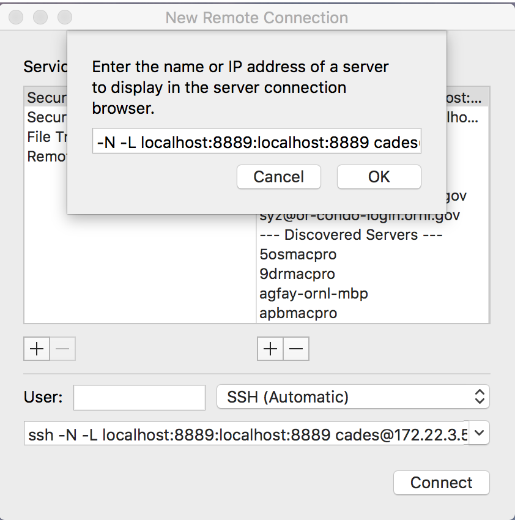
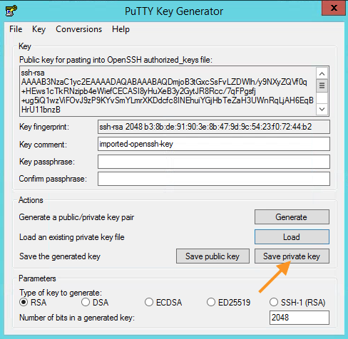
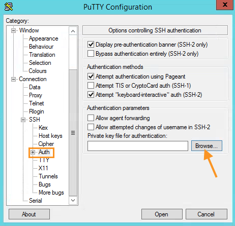
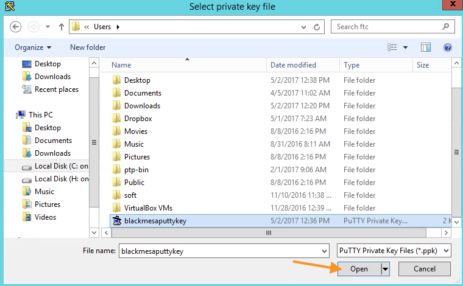
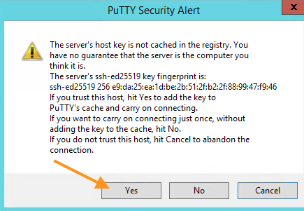
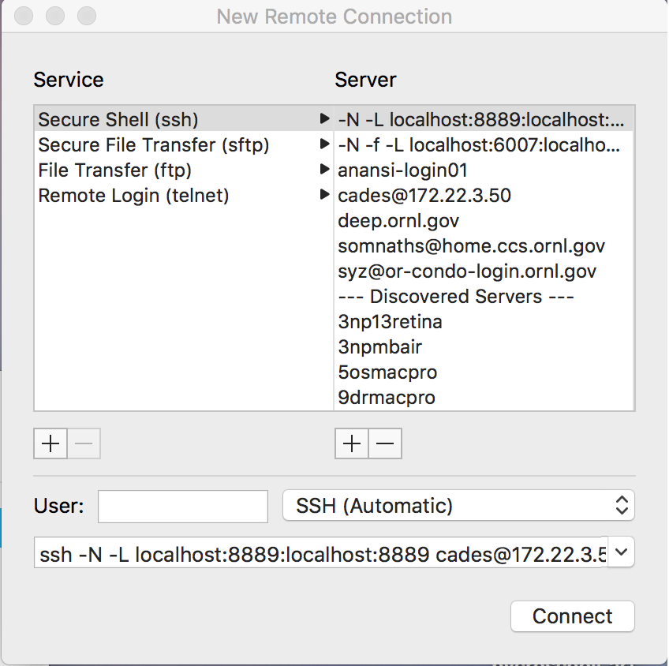

# Setting up a Python Analytics Server

**Suhas Somnath**<br>
Advanced Data and Workflows Group<br>
National Center for Computational Sciences<br>
Oak Ridge National Laboratory

10/9/2017

## Introduction:
-   In this era of exploding data sizes and computationally expensive data analysis algorithms, analyzing data on your personal computer is likely to be infeasible. It is equally infeasible to expect each researcher to purchase powerful computers for their own research since such computers can quickly become prohibitively expensive to procure and maintain. [Cloud](http://support.cades.ornl.gov/index.php/birthright-cloud/), [cluster](http://support.cades.ornl.gov/index.php/shpc-condos/), and [leadership (supercomputers)](https://www.olcf.ornl.gov/computing-resources/) computing resources are ideally suited for such problems.
-   R and python are two of the most popular languages for analyzing scientific data. However, it can be challenging to set up these familiar languages on the aforementioned cloud computing resources for data analytics.
-   These self-service instructions will guide you through the process of creating a `virtual machine` (VM) on the [CADES Birthright](http://support.cades.ornl.gov/index.php/birthright-cloud/) cloud (comparable to a powerful desktop computer and scalable) that you could use instead of your personal computer for data analysis via a [Jupyter](http://jupyter.org) notebook [server](https://www.youtube.com/watch?v=HW29067qVWk).
-   The entire setup process (besides step 0) should take about 20 minutes. Once set up, connecting to the notebook server should only take a few button clicks.

### Support:
-   CADES provides the ability and support to create and use virtual machines. Users are free to use such VMs for a variety of purposes, such as running a Jupyter notebook server. Users are responsible for maintaining the software installed on their own VMs (e.g. - python packages, Jupyter server, etc.).
-   Please follow all steps in this guide to ensure a smooth setup of your analytics VM. For questions regarding the virtual machine itself (steps 0-2), please contact CADES support at <cades-help@ornl.gov>. If you have any questions regarding the setup of anaconda, Jupyter, etc. (steps 3-6) please feel free to contact me at <somnaths@ornl.gov>.

### Other notes:
-   The remote machine runs the [Ubuntu](https://www.ubuntu.com/desktop) (Linux) operating system. You are recommended to take this [short tutorial](https://www.udacity.com/course/linux-command-line-basics--ud595) if you are new to Linux and/or the [command line interface](https://help.ubuntu.com/community/UsingTheTerminal).
-   This document is limited to the instructions necessary for setting up a virtual machine for data analytics using python and is not intended to serve as a comprehensive manual for maintaining and administering your virtual Linux machine or implementing other advanced analytics features such as [JupyterHub](https://github.com/jupyterhub/jupyterhub). Please refer to other online resources for such topics.
-   Though you can set up a [VM for analytics using R](http://support.cades.ornl.gov/user-documentation/_book/openstack/user-tutorials/shiny/shiny.html), this is *NOT* extendable to Matlab and similar proprietary / paid software packages.
-   This virtual machine will be only be accessible within the ORNL network. You would need to use the VPN on an ORNL laptop when off campus or access the machine via Citrix on your personal computer.
-   Many thanks to the Chris Layton, Pete Eby, Ketan Maheshwari from CADES and Ondrej Dyck from CNMS.

## Step 0: Getting a CADES Birthright account:
1.  You will need to request for access to the CADES Birthright Cloud from the following the [instructions here](http://support.cades.ornl.gov/index.php/birthright-cloud/). You should receive a mail within a few minutes to 1-2 hours regarding the approval of your request.
2.  *OPTIONAL*: By default, everyone has access to virtual machines that have up to 8 GB of memory and 16 CPU cores. If you need more, you can request to have your quotas increased by sending an email to CADES <cades-help@ornl.gov> including details such as your three character `UCAMS id`, justification, and duration for the increase in quota in the email.
3.  *OPTIONAL*: Consider joining the `#ornl_cloud` channel on the CADES SLACK group (<cades@slack.com)> to communicate with other users of the CADES cloud.

## Step 1: Creating and Launching an instance:

You can follow CADES’ documentation in the link below but before you do please read:

1.  In `step 4` of `Launch an Instance`:
    1. `Volume Size`: This is the size of the storage drive that will contain the operating system, data, python packages etc. Though the analytics server would still work with the minimum 8 GB volume that is used in the below instructions document, you are recommended to set this to 16 GB or larger. If you intend to use your birthright account exclusively for this analytics server, you can use up your entire quota (eg. 40 GB). Like any personal computer, you can always add volumes to your instance but starting off with a large enough volume can mitigate additional work. Please refer to the additional topics section at the end of this document if you already created an instance but need to add a new storage volume.
    2.  `Image` – choose `Ubuntu` as they do in the tutorial
      

2.  In `step 5` of `Launch an Instance`:
    1.  `Flavor`: This mainly determines the number of processor cores and memory. You CAN change the flavor after creating the instance so do not worry about this step very much. Pick the flavor that best suits your applications:
      - Pick any flavor that begins with `m1.` if you do a lot of statistical analysis that requires a large RAM compared to the number of CPU cores
      - Pick any flavor beginning with `c1.` if you tend to run a lot of small computations in parallel.
      - For additional flavors request CADES to increase your quota. See Step 0.
      - You can always run multiple machines in parallel. So you could distribute your memory / CPUs among two machines that fully utilize your quota.  

Follow [CADES’ instructions](http://support.cades.ornl.gov/user-documentation/_book/openstack/launch-vm.html) to set up your own virtual machine.

## Step 2: Accessing the Instance:

The instructions below are an adaptation of the official CADES documentation:
* For [Mac / Linux](http://support.cades.ornl.gov/user-documentation/_book/openstack/access-vm-ssh.html)
* For [Windows](http://support.cades.ornl.gov/user-documentation/_book/openstack/access-vm-ssh-windows.html)

#### 1. Find the IP address of your machine.
1.  While in the `Horizon` interface you used for creating the instance to your VM, Click on the `Compute` tab, then the `Instances` sub-tab
2.  Copy the `IP address` listed for your instance
    

#### 2.  Get the public ssh key:
1.  Click on the `Access and Security` tab and then navigate to `Key Pairs`.
    
2.  Click on the key. In this case – CADESBirthrightKey
3.  Copy the contents of `Public Key` and paste into a text editor like `TextEdit` in Mac or `Notepad` in Mac.
    
4.  Before saving, make sure to change the format to plain text. This is especially true of `TextEdit` in Mac or `Wordpad` in Windows for example.
5.  Save the file as `id_rsa.pub`

From here on follow instructions specific to your operating system:

### Mac / Linux:

#### 1. Moving the keys:
1.  Rename your private key from the original name (for example - CADESBirthrightKey) via:
```bash
$ mv CADESBirthrightKey id_rsa
```
2.  Move the private and public keys to `~/.ssh/`. For example, if you stored both the private and public keys in Documents.
```bash
$ cd Documents
$ mv id_rsa ~/.ssh/id_rsa
$ mv id_rsa.pub ~/.ssh/id_rsa.pub
```

#### 2. *OPTIONAL*: Graphical Interface for SSH
The Mac `Terminal` application comes with utilities that simplify the ssh process with a graphical interface. If you are comfortable with the command line and do not mind typing ssh / sftp commands you do not need to follow the following steps.
1.  Open the `Terminal` app
2.  Go to `Shell` → `New Remote Connection`
3.  Click on the `+` icon under the right-hand column (`Server`).
4.  Type the address of your instance like `cades@172.22.3.50` into the pop up window as shown in the image below
5.  Click `OK`.
  
6.  You should see a new entry in the `Server` column.
  
7.  We need to add another entry for connecting to the Jupyter server. For this, click on the `+` icon under the right-hand column (`Server`).
8.  Type: `-N -L localhost:8889:localhost:8889 cades@172.22.3.50`. Replace the IP address with that of your machine. Click `OK`.
  
9.  The first entry allows you to connect to your remote machine whereas the second (longer line) allows you to connect to your soon-to-be active jupyter server.
10.  You can use the same entries for other services such as  `Secure File Transfer (sftp)`.

#### 3. Connecting to the instance
* Via the command line interface on the Terminal app:
```bash
ssh cades@172.22.3.50
```
* Via the graphical interface of the Mac Terminal app:
  1. Open the `Terminal` app.
  2.  Go to `Shell` → `New Remote Connection`
  3.  Ensure that `Secure Shell (ssh)` is selected on the left-hand column, then select the first entry you made (`cades@172.22.3.50` in my case) in the right-hand column, and click on the `Connect` button in the bottom right.

### Windows:

#### 1. Install Putty
If you don’t have PuTTY installed, install it via the following links:
* [64 bit](https://the.earth.li/~sgtatham/putty/latest/w64/putty.exe) (most computers)
* [32 bit](https://the.earth.li/~sgtatham/putty/latest/w32/putty.exe) (rare situations)

#### 2.  Convert your private key to PuTTY Format:
1.  Locate and execute `PuTTYGen.exe`.
2.  Click the `Load` button.
  
3.  In the resulting dialog, navigate to the location of your key file.
4.  Select `All Files (*.*)` to show .pem files in the dialog.
5.  Select the appropriate key file and click `Open`.
  
6.  When prompted by the success message, click `OK`.
  
7.  Save the loaded key by clicking `Save private key`.
  
8.  Using the resulting dialog, save the key in an intuitive place (e.g., `C:\Users\Username\SSH`).
9.  Place your private, ppk, and public keys in the above folder.

#### 3.  Configure PuTTY to connect to your instance
1.  Locate and execute `PuTTY.exe`. 
2.  In PuTTY's navigation pane, go to `Connection` → `SSH` → `Auth`.
3.  In the `Options for controlling SSH authentication` screen, click `Browse`.
  
4.  In the resulting dialog, find your .ppk file, and click `Open`.
  
5.  In PuTTY's navigation pane, click Session.
6.  In the Host Name (or IP address) field, enter the IP address of your VM Instance preceded by `cades` (e.g., `cades@172.22.3.50`). 
7.  Ensure that the `SSH` radio button is selected and the `port` is set to 22.
8.  Type a name like JupyterVM and click on the `Save` button so that you don’t need to perform the setup procedure repeatedly. This name need not match the name on Horizon.
  

#### 4.  Configure the tunneling to connect to the Jupyter notebook server:
1.  Go to `SSH` → `Tunnels`
2.  Set the following:
  1. `Source port`: `8889`
  2. `Destination`: `127.0.0.1:8889`
    
  3. Click on the `Add` button. You should see the following under `Forwarded ports`:
  

3.  Go back to Session. Highlight the name of the configuration `PycroscopyVM`. and click on the `Save` button.
  
4.  You can verify that the tunneling settings have been saved by:
    1.  Closing Putty,
    2. Reopening Putty,
    3. Loading the configuration PycroscopyVM
    4. Navigating to `SSH` → `Tunnels`
    5.  The line containing the port forwarding should still be there.
    6. If it is not, re-do the appropriate steps above.

#### 5.  Connect to the instance:
1.  After loading the appropriate session created in the preceding steps, click `Open` to connect to your VM Instance using SSH.
2.  If and when prompted, choose to cache the server's fingerprint (click `Yes`).


## Step 3: Installing analytics packages on the instance:
1. Download [Anaconda](https://www.anaconda.com/download/) 4.2 -&gt; python 3.5. You can download a different version if you wish.

  ```bash
  $ mkdir temp
  $ curl https://repo.continuum.io/archive/Anaconda3-4.2.0-Linux-x86_64.sh > temp/Anaconda3-4.2.0-Linux-x86_64.sh
  ```

2. Change privileges before installing Anaconda

  ```bash
  $ chmod +x temp/Anaconda3-4.2.0-Linux-x86_64.sh
  ```

3. Install Anaconda:
    1. Start the installer
        ```bash
		$ bash temp/Anaconda3-4.2.0-Linux-x86_64.sh
	    ```
    2. Follow the prompts to install Anaconda. Accept the license, say yes to installing to the default location, say yes to prepending anaconda to the path.
    3. Delete temporary installation folder:
        ```bash
        $ rm -r temp
        ```
4. Switch to anaconda environment:
	```bash
	$ source ~/.bashrc
	```
5. Install missing packages for wholesome Jupyter functionality:
	  
    1. Enable ability to export to pdf in Jupyter:
        ```bash
	    $ conda install -c anaconda-nb-extensions nbbrowserpdf
        ```

	2. Enable javascript for interactive elements in Jupyter:
	    ```bash
        $ jupyter nbextension enable --py --sys-prefix widgetsnbextension
        ```

6. *OPTIONAL:* To simplify the command to start up the Jupyter notebook:

	1. First create the configuration file:
    ```bash
    $ jupyter notebook --generate-config
    ```

	2. open up the notebook:
    ```bash
    $ nano ~/.jupyter/jupyter_notebook_config.py
    ```

	3. Use the key combination `Ctrl+W` to search for `.open_browswer`
	4. uncomment the line
	5. set the flag to `False`
	6. search for `NotebookApp.port = 8888` using `Ctrl+W`
	7. uncomment the line
	8. set the `port` number to `8889` (or any number &gt; 1024 for that matter)
	9. Close the editor with `Ctrl+X`
	10. Save the file

7. *OPTIONAL* - You can always install any python packages from this point on. You could install deep-learning frameworks like Keras or TensorFlow but you are recommended to use optimized Docker containers for this. Please refer to [this separate tutorial](https://github.com/pycroscopy/cades_birthright/blob/master/deep_learning_container.md) for this.

## Step 4: Starting a Jupyter server:

1. Ensure that you don’t leave room for accidental damage to the rest of the VM (such as the anaconda folder etc.) by starting the jupyter notebook in a new / separate folder. Perhaps this folder contains data + notebooks etc. For now, we will make an empty folder and start the notebook from there:
  ```bash
  $ mkdir workspace
  $ cd workspace
  ```
2. *OPTIONAL:* – **Persistent Jupyter server**: As it stands, if you close this ssh session, your command or operation (for example, a running jupyer server) will be aborted as well. In order to keep the jupyter server easily accessible, we will need to either use the [`screen`](http://dasunhegoda.com/unix-screen-command/263/) or the [`tmux`](https://robots.thoughtbot.com/a-tmux-crash-course) commands. We will be using [screen](https://uisapp2.iu.edu/confluence-prd/pages/viewpage.action?pageId=115540034) here. Note that this approach does **not** keep your *ssh connection to the jupyter server* (discussed in the next step) alive if your local computer goes to sleep or is shut down. IF you need your computation / analysis to run even after you shut down your local machine, you are recommend to run your analysis as a script on the remote machine instead of using the jupyter interface. If you decide to use `screen`, type the following command **BEFORE** you initiate the Jupyter server:
  ```bash
  $ screen
  ```

3. Starting the Jupyter server:
  * If you modified the configuration file that was optional in the previous step:
    ```bash
    $ jupyter notebook
    ```

  * If you did NOT follow the optional instructions, specify the port and no-browser flags
    ```bash
    $ jupyter notebook --no-browser --port=8889
    ```

4. *OPTIONAL*: If you ran the notebook with screen:
  1. you can now `detach` the screen using the following key sequence:
    ```bash
    Ctrl+A Ctrl+d
    ```

  2. You can now close the ssh session to the remote machine. This will NOT close your jupyter server.
    ```bash
    $ exit
    ```

## Step 5: Accessing the Jupyter server:

### Mac / Linux:
Connection in the Mac Terminal app:
1.  Open the Terminal
2. Depending on which method you prefer (and have set up):
    1. Command line interface:
      ```bash
      $ ssh -N -L localhost:8889:localhost:8889 cades@172.22.3.50
      ```

    2.  Graphical Interface:
        1. Go to Shell → New Remote Connection
        2.  To connect to your Jupyter server, ensure that `Secure Shell (ssh)` is
            selected on the left-hand side column, then select the second entry
            you made (`-N -L localhost:8889:localhost:8889 cades@172.22.3.50` in
            my case), and click on the `Connect` button in the bottom right.
            
3.  Open a browser and go to: <http://localhost:8889/>

### Windows:
1.  Close any open Putty connections to the VM
2.  Open Putty, load the configurations for your machine and connect. You will be presented with a new SSH connection to the VM. You can close this if you do not need it.
3.  Open a browser and go to: <http://localhost:8889/>

## Best Practices and ethical use of the cloud:
A virtual machine is like a public-use desktop or a laptop. It [costs](https://cloud.google.com/compute/pricing) [money](https://aws.amazon.com/ec2/pricing/on-demand/) to run VMs and reserving resources for your VM, precludes others from utilizing resources. Here are a few guidelines for using and managing VMs:
* If you are not using the VM for extended periods or are not using all the horsepower, consider resizing to a smaller flavor (fewer CPU cores and smaller RAM). Remember that you can always resize it back to something bigger whenever necessary. 
* Additionally, you can shut down your VM, just like you would shut down your personal computer
* Consider deleting VMs you will never use again 

## Step 6: Shutting down the Jupyter server:
Once you are done working on your jupyer server, you will need to:
*  If you used `screen` and closed your ssh connection to
    your virtual machine where you initiated the Jupyter server: ssh
    into your virtual machine:
    1.  Windows – use your saved putty profile
    2.  Mac / Linux: Use either the command line or graphical interface described in Step 2. For the command line interface - open the terminal and replace with your IP address:

      ```bash
      $ ssh cades@172.22.3.50
      ```

At this point, you should either have access to an existing ssh connection to the remote machine or you should have created a new connection in the preceding step.

*  If you used `screen`, re-attach the screen where your jupyer notebook server is running by typing:

    ```bash
    $ screen –r
    ```

You should be seeing the print logs of the Jupyter server on the remote machine now.

*  Press `Ctrl+C` twice to shut down the Jupyter server as you normally would on your local machine
