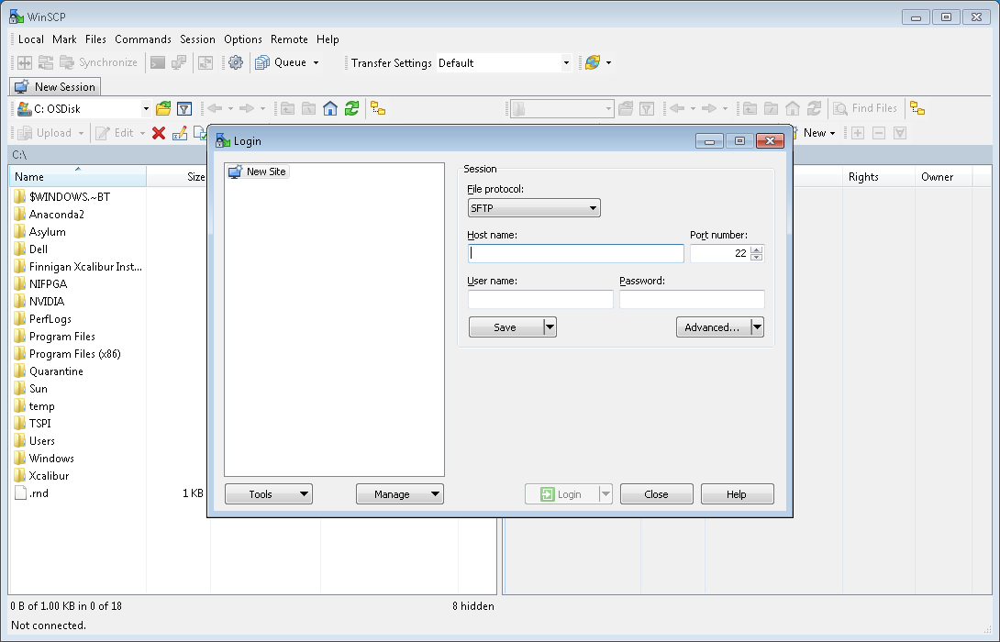
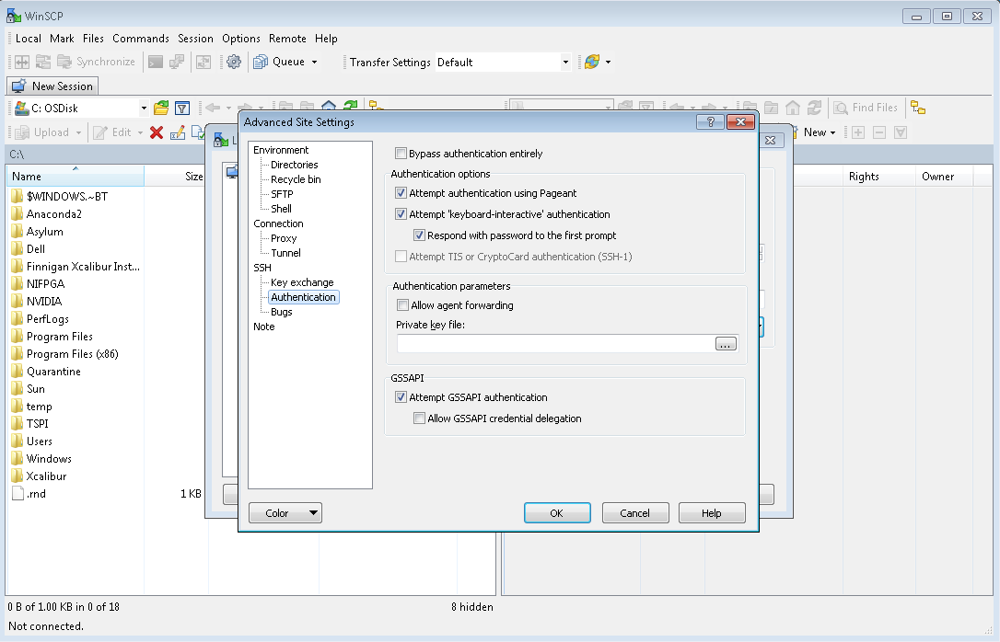
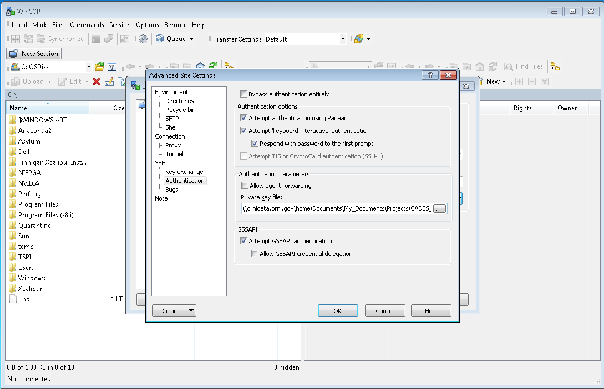
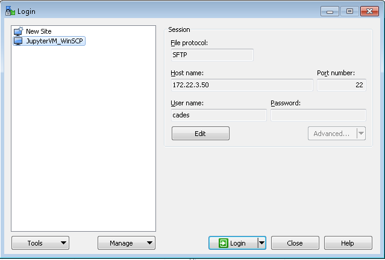

# Transferring Files

**Suhas Somnath**<br>
Advanced Data and Workflows Group<br>
National Center for Computational Sciences<br>
Oak Ridge National Laboratory

10/9/2017

With the exception to file transfers, most other topics regarding the operation of this VM are related to routine operation and administration of conventional Linux computers and you are recommended to refer to numerous online resources for these topics.

## Basic file transfers to / from the remote machine:
You will often need to transfer files to the remote server to start computing and vice versa to download results.
-   You can always upload files via the Jupyter server itself but try to limit this to small files.
-   Use [`Secure File Transfer Protocol`](https://kb.wisc.edu/cae/page.php?id=32991) (SFTP) to transfer large files to and from the remote machine instead. Note that the default SCP / SFTP protocol requires the use of the command-line just like SSH.
-   Alternatively, one could use a file transfer client like [FileZilla](https://filezilla-project.org) that provides a conventient graphical interface to drag and drop files. 
-   Windows users can use [WinSCP](https://winscp.net/eng/download.php), which is a popular alternative to FileZilla. 

## SFTP:
Note that You cannot use the `SFTP` session to unzip, open, modify the files etc. For this you will need a new / existing SSH session. Alternatively, you can access the terminal on the remote machine via the Jupyter notebook server.

### Initiating SFTP:

#### Linux / Mac OS:
1.  Open a new terminal. This should put you in the `home` directory of your local machine by default (one level above Documents, Downloads etc.).
2.  Navigate to the folder of interest on your local machine using the `cd` command.
3.  Type the following command (replace with your remote machine’s IP address). Using the graphical interface automatically starts the `sftp` session in the home directories of both your local and remote machines.
    ```bash
    $ sftp cades@172.22.3.50
    ```

4.  Follow the steps below for transferring files

#### Windows:
1.  Access the command prompt by clicking on the `Start` button and typing `cmd`. Hit `Enter`.
2.  Navigate to the local folder you want to transfer files from using the `cd` command.
3.  Connect to the remote machine via the command below. Replace the IP address with that of your remote machine and *JupyterVM* with the name you gave to your `putty profile` in step 2.
    ```bash
    $ pstfp cades@172.22.3.50 -load JupyterVM
    ```

4.  Follow the steps below for transferring files

### Transferring files - Linux / Mac / Windows:
1.  Transfer a file from your local machine to the remote / virtual machine via:
    ```bash
    $ put ./Desktop/my/local/file.zip ./remote/folder/my_file.zip
    ```

2.  Transfer entire folders to the virtual machine:
    ```bash
    $ put –r ./path/to/local_folder ./path/to/remote_dir/
    ```

3.  Download a file:

    ```bash
    $ get ./remote/folder/remote_file ./path/to/local/folder/
    ```
### The standard Linux commands
The standard Linux commands `pwd`, `mkdir`, `ls`, `cd`, etc. operate only on the remote machine. Add `l` (for local) as a prefix to these commands to perform the same operations on the local machine (your personal computer). For example, you would navigate the file structure on the virtual machine using `cd` and on your local machine using `lcd`.

## WinSCP:
This [youtube video](https://www.youtube.com/watch?v=58KmUBaEW34) walks you through most of the common steps starting from installtion to file transfers. However, the setup process for VMs on CADES will is different compared to what is shown in the video. Here are the steps specifically associated with authentication:

Opening WinSCP typically presents such a window with no existing profiles and a prompt to create a new profile


Click on the `Advanced` button on the bottom right and click on `Advanced Site Settings` or something similar. A new window will be presented to you with two panes. On the left hand pane, click on `Authentication` under `SSH`. You will be presented with this view:


On the right hand pane, under the `Authentication Parameters` section, click on the browse (`...`) button corresponding to `Private key file`. This will present a file browser window. Now navigate to the folder containing the `private key` generated using `Putty`. Select this file and click `Open`. 


You should be presented with the previous window, now with hte path to the `Private key file` filled in. Now click on the `OK` button on the bottom of the window. This window will now close and you wil be presented with the `Login` window again. 



Here, enter the `IP adderess` under the `Host name`. Set the `User name` to `cades`. You can leave the `Password` field empty. Now we need to save this configuration. On the left hand pane, right click on the `New Site` entry and select `Save session` or simiar.


In the new window that is presented, pick a descriptive name for the `Site name`. Here, I have picked `JupyterVM_WinSCP`. Also click on the checkbox for `Create desktop shortcut` if you are interested. Click on the `OK` button


You should not need to enter any more details for this VM again!. You will now see your configuration as an option on the left pane as shown below. Click on the `Login` button to log into the VM.



Follow the rest of the instructions shown in the [youtube video](https://www.youtube.com/watch?v=58KmUBaEW34) again to begin transferring files!
